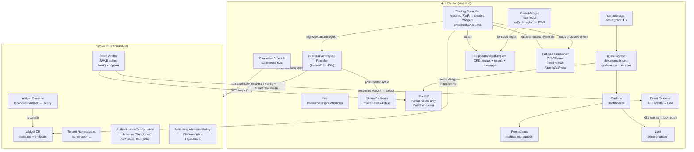
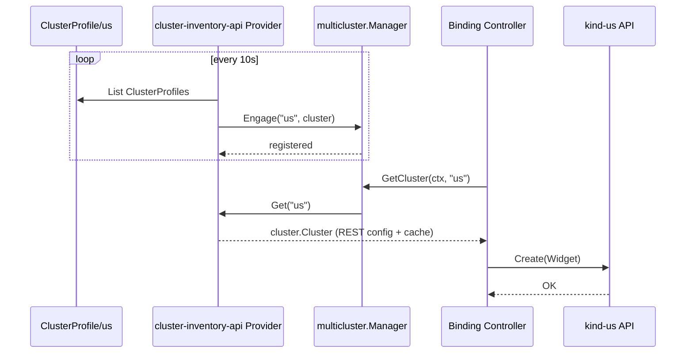
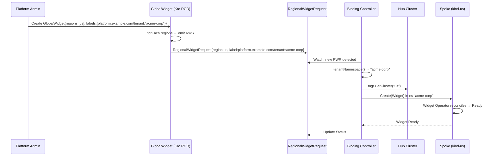

# Phase 0 — Architecture Overview

> **v2 Trust Model** (feat/oidc-trust-v2): Controllers use projected ServiceAccount tokens with Kubelet rotation. Humans use Dex OIDC. Spoke uses AuthenticationConfiguration instead of legacy oidc-* flags. See [Phase 10](10-oidc-trust.md) and [design doc](../design/oidc-trust-v2.md).

## Multi-Cluster Runtime

The platform connects a central **hub** cluster to one or more satellite **spoke** clusters using the `sigs.k8s.io/multicluster-runtime` framework. The hub serves as the control plane for declarative multi-cluster workload orchestration through [Kro](https://github.com/kubernetes-sigs/kro) Resource Graph Definitions (RGDs).

### How Multi-Cluster Works



**The multi-cluster runtime** (`providers/cluster-inventory-api/provider.go`) implements the `multicluster.Provider` interface:

1. **Discovery** — polls `ClusterProfile` CRDs on the hub, extracting kubeconfig Secrets
2. **Engagement** — calls `mgr.Engage(ctx, regionName, cluster)` to register spoke clusters with the controller-runtime multicluster manager
3. **Change detection** — computes clusterKey from server URL + CA certificate data; on server change, disengages old cluster and re-engages new (v2: token-only changes no longer trigger re-engagement)
4. **Delegation** — controllers like the binding-controller call `mgr.GetCluster(ctx, region)` to obtain a `cluster.Cluster` that provides a `client.Client` scoped to the spoke



### Multi-Tenancy

Multi-tenancy is implemented at the workload layer through the `tenant` field on `RegionalWidgetRequest` (`deploy/platform-mvp/chart/crds/templates/regionalwidgetrequest-crd.yaml:40-45`):

```yaml
labels:
  type: object
  properties:
    platform.example.com/tenant:
      type: string
      description: Tenant identifier used as spoke-side namespace for workload isolation
```

**Flow:**



See [Phase 9 — Multi-Tenancy](09-multi-tenancy.md) for full details including spoke-side tenant RBAC provisioning.

## Component Map

| Component | Cluster | Source | Purpose |
|-----------|---------|--------|---------|
| **Kro** | hub | `sigs.k8s.io/kro` | ResourceGraphDefinition engine; expands GlobalWidget → RegionalWidgetRequests |
| **ClusterProfile CRD** | hub | `deploy/platform-mvp/chart/hub-services/templates/fleet.yaml` | Declares spoke clusters to the multicluster provider |
| **cluster-inventory-api Provider** | hub | `providers/cluster-inventory-api/provider.go` | Implements `multicluster.Provider`; discovers + engages spoke clusters; v2 uses BearerTokenFile for auth |
| **Binding Controller** | hub | `platform-mvp/binding-controller/` | Watches `RegionalWidgetRequest` on hub, creates `Widget` on spoke; uses projected SA tokens for spoke auth |
| **Hub kube-apiserver** | hub | Kubernetes built-in | Serves as OIDC issuer for controller ServiceAccount tokens (`/.well-known/openid-configuration`, `/openid/v1/jwks`) |
| **Dex IDP** | hub | Helm subchart (`dex`), config at `chart/infrastructure/templates/dex.yaml` | OIDC identity provider for human/platform admin auth |
| **cert-manager** | hub | Helm subchart, self-signed ClusterIssuer at `chart/infrastructure/templates/cert-manager.yaml` | TLS certificates for Dex + Grafana ingress |
| **nginx-ingress** | hub | Helm subchart (`ingress-nginx`) | Exposes Dex and Grafana externally |
| **Prometheus** | hub | kube-prometheus-stack | Scrapes binding-controller metrics every 15s |
| **Grafana** | hub | kube-prometheus-stack (bundled) | Dashboards: chainsaw-results, cluster-fitness, controller-deep-dive |
| **Loki** | hub | grafana/loki (SingleBinary) | Log aggregation; receives Kubernetes events from event-exporter |
| **Event Exporter** | hub | `chart/infrastructure/templates/event-exporter.yaml` | Routes Kubernetes events to Loki with structured labels |
| **Chainsaw CronJob** | hub | `chart/infrastructure/templates/chainsaw-cronjob.yaml` | Runs E2E test suite every 2m against both clusters; pushes results to Loki |
| **Widget Operator** | spoke | `platform-mvp/widget-operator/` | Reconciles Widget CR: Pending → Ready (2s delay) |
| **OIDC Verifier** | spoke | `platform-mvp/oidc-verifier/` | Polls Dex JWKS every 5m; validates Bearer tokens via `/verify`; emits structured AUDIT logs |
| **AuthenticationConfiguration** | spoke | `chart/us/templates/auth-config.yaml` | Spoke kube-apiserver auth config: hub issuer (controllers) + Dex issuer (humans) |
| **ValidatingAdmissionPolicy** | spoke | `chart/us/templates/admission-guardrails.yaml` | Platform Wins guardrails: restrict ClusterRole mgmt, protect system ns, protect auth config |

---

## How to Run

```bash
# Build all images, create kind clusters, deploy hub + us
make deploy

# Enable GitOps (Flux CD) — self-healing continuous delivery
make deploy-cd

# Build + deploy in-cluster Chainsaw test runner
make chainsaw-runner

# Run full E2E validation (20 tests)
make validate

# Tear everything down
make clean
```

## Phase Index

| Phase | Document | What It Covers |
|-------|----------|----------------|
| 0 | `00-overview.md` | Architecture, multi-cluster runtime, multi-tenancy, component map |
| 1 | `01-kind-topology.md` | kind cluster topology (hub + us), cross-cluster networking |
| 2 | — | Widget Operator (spoke-side CRD + reconciler) — covered inline in chart docs |
| 3 | `03-fleet-registration.md` | ClusterProfile CRD, cluster-inventory-api Provider, spoke engagement |
| 4 | `04-kro-downstream-orchestration.md` | Kro RGD (GlobalWidget → RegionalWidgetRequest), downstream orchestration guinea pig example |
| 5 | `05-binding-controller.md` | Hub-side reconciler: RWR → Widget on spoke, tenant namespace isolation |
| 6 | `06-e2e-verification.md` | All Chainsaw E2E tests |
| 7 | `07-token-rotator.md` | **REMOVED (historical)** — v1 component, code deleted; replaced by projected SA tokens in v2 |
| 8 | `08-observability.md` | Prometheus, Grafana dashboards, Loki, event-exporter, Chainsaw CronJob |
| 9 | `09-multi-tenancy.md` | Tenant isolation via platform.example.com/tenant label, spoke-side namespace + RBAC with 3 role tiers (admin/developer/analyst) |
| 10 | `10-oidc-trust.md` | **v2**: Split identity model — projected SA tokens (controllers) + Dex OIDC (humans), AuthenticationConfiguration |
| 11 | `../design/oidc-trust-v2.md` | Full v2 trust model design document |
| 12 | `12-security-guardrails.md` | Platform Wins: ValidatingAdmissionPolicy guardrails |
| 99 | `99-extending-to-eu-asia.md` | Adding EU/ASIA regions — zero code changes required |

---

## Key Design Decisions

1. **Hub-spoke over flat mesh**: The hub is the single source of truth. All cross-cluster decisions originate there. Spokes are stateless consumers.

2. **Split identity model**: Controllers authenticate with **projected ServiceAccount tokens** (hub kube-apiserver as issuer, Kubelet-managed rotation). Humans authenticate with **Dex OIDC** (external IdP). Clean separation of service and human identity.

3. **Credentials over direct API access**: The hub does not permanently cache spoke kubeconfigs. Tokens are rotated automatically by the Kubelet (~1h) and the provider constructs REST configs with `BearerTokenFile` paths.

4. **Declarative cluster inventory**: Adding a new region is a matter of creating another `ClusterProfile` CRD and deploying the widget-operator + oidc-verifier. The Kro RGD, binding-controller, and provider handle the rest automatically via the discovery loop.

5. **Tenant isolation via namespaces**: Tenants are scoped to spoke-side Kubernetes namespaces with dedicated RBAC. The binding-controller routes Widgets to the correct namespace based on the `platform.example.com/tenant` label on the `RegionalWidgetRequest`.

6. **Continuous compliance**: The Chainsaw CronJob runs the full E2E suite every 2 minutes in-cluster, pushing structured results to Loki. Grafana dashboards render pass/fail trends and controller health in real time.

7. **Platform Wins guardrails**: `ValidatingAdmissionPolicy` resources prevent non-platform-admin identities from modifying ClusterRoles, system namespaces, or the AuthenticationConfiguration. Enabled by default.