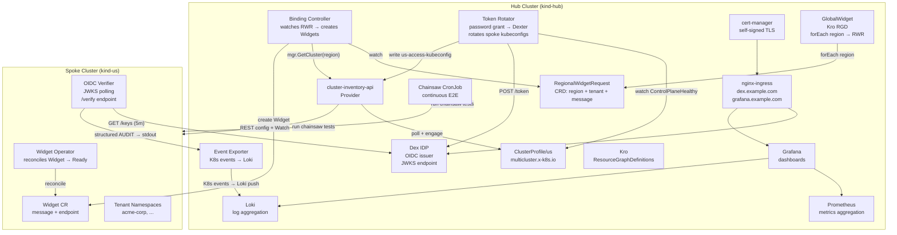
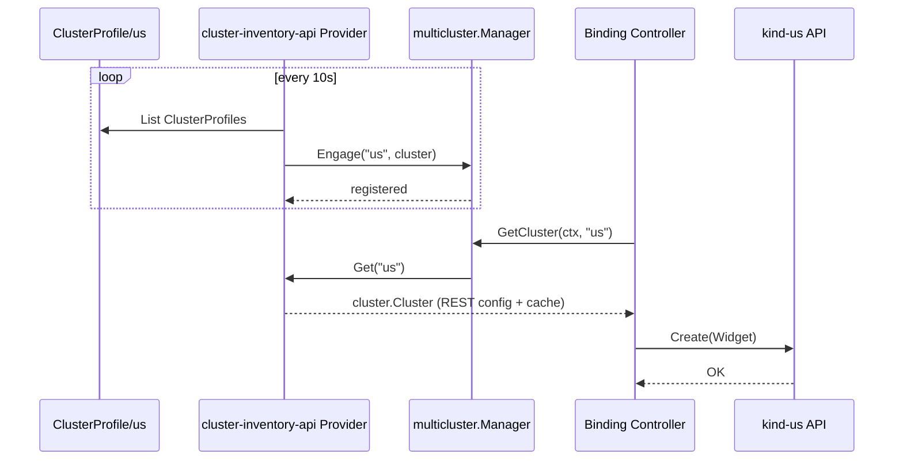
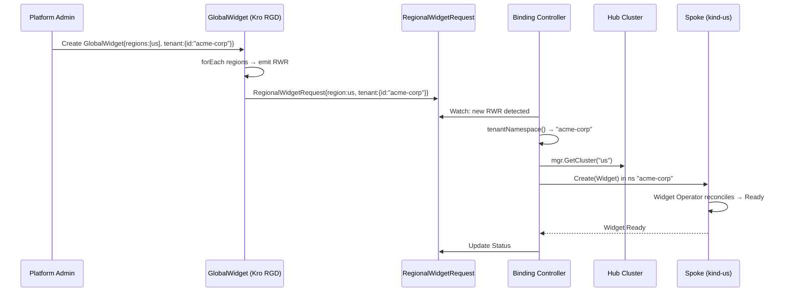

# Phase 0 — Architecture Overview

## Multi-Cluster Runtime

The platform connects a central **hub** cluster to one or more satellite **spoke** clusters using the `sigs.k8s.io/multicluster-runtime` framework. The hub serves as the control plane for declarative multi-cluster workload orchestration through [Kro](https://github.com/kubernetes-sigs/kro) Resource Graph Definitions (RGDs).

### How Multi-Cluster Works



**The multi-cluster runtime** (`providers/cluster-inventory-api/provider.go`) implements the `multicluster.Provider` interface:

1. **Discovery** — polls `ClusterProfile` CRDs on the hub, extracting kubeconfig Secrets
2. **Engagement** — calls `mgr.Engage(ctx, regionName, cluster)` to register spoke clusters with the controller-runtime multicluster manager
3. **Change detection** — SHA256-hashes kubeconfig bytes; on change, disengages old cluster and re-engages new
4. **Delegation** — controllers like the binding-controller call `mgr.GetCluster(ctx, region)` to obtain a `cluster.Cluster` that provides a `client.Client` scoped to the spoke



### Multi-Tenancy

Multi-tenancy is implemented at the workload layer through the `tenant` field on `RegionalWidgetRequest` (`deploy/platform-mvp/chart/hub/templates/regionalwidgetrequest-crd.yaml:40-45`):

```yaml
tenant:
  type: object
  properties:
    id:
      type: string
      description: Tenant identifier used as spoke-side namespace for workload isolation
```

**Flow:**



See [Phase 9 — Multi-Tenancy](09-multi-tenancy.md) for full details including spoke-side tenant RBAC provisioning.

## Component Map

| Component | Cluster | Source | Purpose |
|-----------|---------|--------|---------|
| **Kro** | hub | `sigs.k8s.io/kro` | ResourceGraphDefinition engine; expands GlobalWidget → RegionalWidgetRequests |
| **ClusterProfile CRD** | hub | `deploy/platform-mvp/chart/hub/templates/fleet.yaml` | Declares spoke clusters to the multicluster provider |
| **cluster-inventory-api Provider** | hub | `providers/cluster-inventory-api/provider.go` | Implements `multicluster.Provider`; discovers + engages spoke clusters |
| **Binding Controller** | hub | `platform-mvp/binding-controller/` | Watches `RegionalWidgetRequest` on hub, creates `Widget` on spoke |
| **Token Rotator** | hub | `platform-mvp/token-rotator/` | Authenticates to Dex (password grant), rotates spoke kubeconfig tokens every 5m |
| **Dex IDP** | hub | Helm subchart (`dex`), config at `chart/hub/templates/dex.yaml` | OIDC identity provider; issues JWTs, serves JWKS |
| **cert-manager** | hub | Helm subchart, self-signed ClusterIssuer at `chart/hub/templates/cert-manager.yaml` | TLS certificates for Dex + Grafana ingress |
| **nginx-ingress** | hub | Helm subchart (`ingress-nginx`) | Exposes Dex and Grafana externally |
| **Prometheus** | hub | kube-prometheus-stack | Scrapes binding-controller + token-rotator metrics every 15s |
| **Grafana** | hub | kube-prometheus-stack (bundled) | Dashboards: chainsaw-results, cluster-fitness, controller-deep-dive, token-rotation |
| **Loki** | hub | grafana/loki (SingleBinary) | Log aggregation; receives Kubernetes events from event-exporter |
| **Event Exporter** | hub | `chart/hub/templates/event-exporter.yaml` | Routes Kubernetes events to Loki with structured labels |
| **Chainsaw CronJob** | hub | `chart/hub/templates/chainsaw-cronjob.yaml` | Runs E2E test suite every 2m against both clusters; pushes results to Loki |
| **Widget Operator** | spoke | `platform-mvp/widget-operator/` | Reconciles Widget CR: Pending → Ready (2s delay) |
| **OIDC Verifier** | spoke | `platform-mvp/oidc-verifier/` | Polls Dex JWKS every 5m; validates Bearer tokens via `/verify`; emits structured AUDIT logs |

---

## How to Run

```bash
# Build all images, create kind clusters, deploy hub + us
make deploy

# Enable GitOps (Flux CD) — self-healing continuous delivery
make deploy-cd

# Build + deploy in-cluster Chainsaw test runner
make chainsaw-runner

# Run full E2E validation (15 tests)
make validate

# Tear everything down
make clean
```

## Phase Index

| Phase | Document | What It Covers |
|-------|----------|----------------|
| 0 | `00-overview.md` | Architecture, multi-cluster runtime, multi-tenancy, component map |
| 1 | `01-kind-topology.md` | kind cluster topology (hub + us), cross-cluster networking |
| 2 | — | Widget Operator (spoke-side CRD + reconciler) — covered inline in chart docs |
| 3 | `03-fleet-registration.md` | ClusterProfile CRD, cluster-inventory-api Provider, spoke engagement |
| 4 | `04-kro-globalbucket-api.md` | Kro RGD (GlobalWidget → RegionalWidgetRequest), tenant passthrough |
| 5 | `05-binding-controller.md` | Hub-side reconciler: RWR → Widget on spoke, tenant namespace isolation |
| 6 | `06-e2e-verification.md` | All 15 Chainsaw E2E tests |
| 7 | `07-token-rotator.md` | Token rotation lifecycle, Dex password grant, rotating trust |
| 8 | `08-observability.md` | Prometheus, Grafana dashboards, Loki, event-exporter, Chainsaw CronJob |
| 9 | `09-multi-tenancy.md` | Tenant isolation via spec.tenant.id, spoke-side namespace + RBAC |
| 10 | `10-oidc-trust.md` | Dex IDP → OIDC Verifier cross-cluster trust, JWKS polling, audit trail |
| 99 | `99-extending-to-eu-asia.md` | Adding EU/ASIA regions — zero code changes required |

---

## Key Design Decisions

1. **Hub-spoke over flat mesh**: The hub is the single source of truth. All cross-cluster decisions originate there. Spokes are stateless consumers.

2. **Credentials over direct API access**: The hub does not permanently cache spoke kubeconfigs. The token-rotator refreshes them every 5 minutes via Dex OIDC, and the multicluster provider detects changes via SHA256 hashing.

3. **Declarative cluster inventory**: Adding a new region is a matter of creating another `ClusterProfile` CRD and deploying the widget-operator + oidc-verifier. The Kro RGD, binding-controller, and token-rotator handle the rest automatically via the provider's discovery loop.

4. **Tenant isolation via namespaces**: Tenants are scoped to spoke-side Kubernetes namespaces with dedicated RBAC. The binding-controller routes Widgets to the correct namespace based on `spec.tenant.id` on the `RegionalWidgetRequest`.

5. **Continuous compliance**: The Chainsaw CronJob runs the full E2E suite every 2 minutes in-cluster, pushing structured results to Loki. Grafana dashboards render pass/fail trends and controller health in real time.