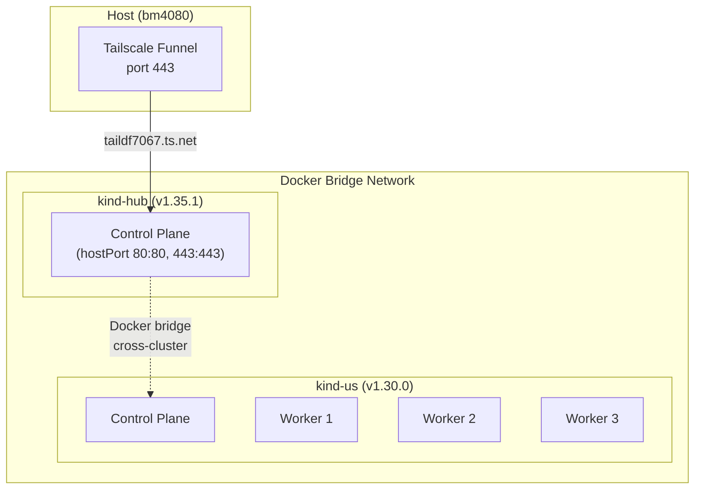

# Phase 1 — Kind Topology

Two reachable kind clusters: `hub` and `us`, connected via Docker bridge network.

## Topology



- **Hub**: 1 control-plane node with hostPort 80+443 (nginx-ingress)
- **Us**: 1 control-plane + 3 workers (no hostPort)
- **Cross-cluster**: Clusters communicate via Docker bridge network (internal IPs)

## Prerequisites

- Docker, kind, kubectl installed

## Steps

```bash
# Create hub (1 control-plane)
kind create cluster --name hub --config deploy/platform-mvp/kind/kind-hub.yaml

# Create us (1 control-plane + 3 workers)
kind create cluster --name us --config deploy/platform-mvp/kind/kind-us.yaml

# Extract internal kubeconfig for cross-cluster access
kind get kubeconfig --name us --internal > hack/platform-mvp/kubeconfig-us-internal

# Verify cross-cluster reachability
HUB_IP=$(docker inspect -f '{{range.NetworkSettings.Networks}}{{.IPAddress}}{{end}}' kind-hub-control-plane)
docker exec kind-us-control-plane ping -c1 ${HUB_IP}
```

Or use the script:
```bash
./hack/platform-mvp/create-clusters.sh
```

## Files Produced

| File | Purpose |
|------|---------|
| `deploy/platform-mvp/kind/kind-hub.yaml` | Hub cluster config (hostPort 80+443) |
| `deploy/platform-mvp/kind/kind-us.yaml` | Us cluster config (1 CP + 3 workers) |
| `hack/platform-mvp/create-clusters.sh` | Automated cluster creation |
| `hack/platform-mvp/destroy-clusters.sh` | Automated cluster teardown |

## Acceptance

- `kubectl --context kind-hub get nodes` — 1 node Ready
- `kubectl --context kind-us get nodes` — 4 nodes Ready
- Cross-cluster network connectivity verified
- `chainsaw test tests/e2e --test-dir tests/01-hub-cluster-ready --test-dir tests/02-us-cluster-ready` passes