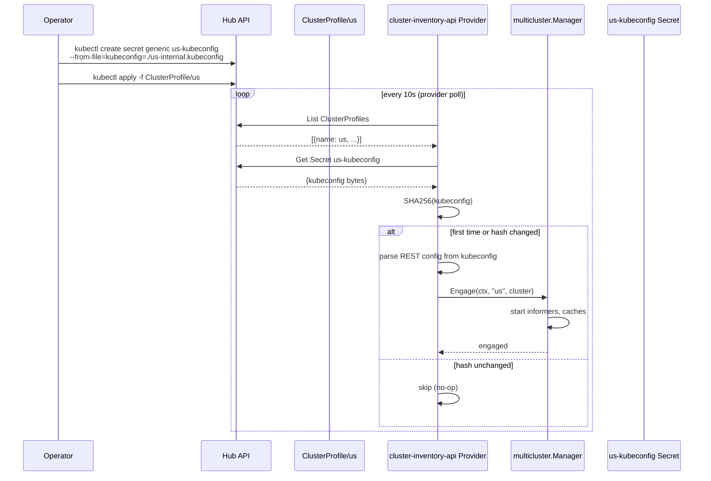

# Phase 3 — Fleet Registration

Registering the `us` spoke cluster on the hub via `ClusterProfile` CRD and the `cluster-inventory-api` multicluster provider.

---

## How It Works



## Provider Implementation

The provider at `providers/cluster-inventory-api/provider.go` implements `sigs.k8s.io/multicluster-runtime`'s `Provider` interface:

```go
type Provider interface {
    Get(ctx context.Context, clusterName string) (cluster.Cluster, error)
    IndexField(ctx context.Context, obj client.Object, field string, extractValue client.IndexerFunc) error
}
```

Plus the convention-based `Run(ctx, mgr)` method for cluster discovery.

### Poll Loop (`provider.go:120-222`)

1. **Discover** — `hubClient.List(ctx, &clusterProfiles)` at configured interval (default 10s)
2. **Locate kubeconfig** — Look up `<name>-kubeconfig` Secret in same namespace as ClusterProfile
3. **Change detection** — SHA256-hash kubeconfig bytes; skip if unchanged
4. **Disengage old** — If hash changed, cancel old cluster's context
5. **Build cluster** — Parse kubeconfig → `cluster.New(restConfig, scheme)`
6. **Engage** — `mgr.Engage(ctx, name, cl)` registers the spoke
7. **Replay indexes** — Replay any registered `IndexField` calls against the new cluster
8. **Cleanup** — Remove clusters whose ClusterProfile has been deleted

### Change Detection & Token Rotation (`provider.go:168-177`)

The provider detects kubeconfig changes by hashing Secret data. This is how the **token-rotator** integrates:

- Token-rotator writes new tokens to `us-access-kubeconfig` Secret every 5 minutes
- Provider detects SHA256 change on next poll cycle
- Disengages old cluster, engages new one with fresh credentials
- **Controllers automatically use new credentials** — no restart needed

## ClusterProfile CRD

Defined in `deploy/platform-mvp/chart/hub/templates/fleet.yaml`:

```yaml
apiVersion: multicluster.x-k8s.io/v1alpha1
kind: ClusterProfile
metadata:
  name: us
```

The `status` subresource includes:

| Field | Purpose |
|-------|---------|
| `conditions[type=ControlPlaneHealthy]` | Gated by token-rotator; rotation only proceeds when `True` |
| `accessProviders[*].cluster` | Contains `server` URL and `certificateAuthorityData` for kubeconfig assembly |

In production, a control plane health controller would populate `ControlPlaneHealthy` based on actual spoke API reachability. For E2E testing, this is patched manually.

## Acceptance

- `ClusterProfile us` visible on hub
- Provider discovers and engages the spoke
- `multicluster.Manager.GetCluster(ctx, "us")` returns a working cluster client
- `04-fleet-registration` Chainsaw test passes

## Key Files

| File | Purpose |
|------|---------|
| `providers/cluster-inventory-api/provider.go` | Provider: poll loop, engagement, SHA256 change detection |
| `deploy/platform-mvp/chart/hub/templates/fleet.yaml` | ClusterProfile/us manifest |
| `platform-mvp/binding-controller/main.go:123-176` | `staticProvider` — dev fallback (single cluster via kubeconfig flag) |