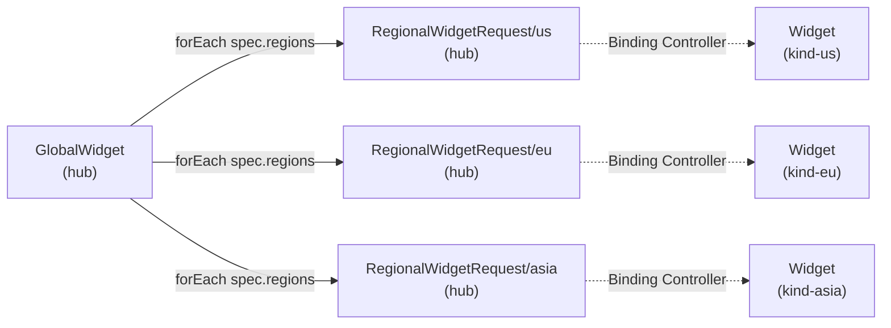

# Phase 4 — Kro GlobalWidget API

The Kro `GlobalWidget` ResourceGraphDefinition (RGD) on the hub declaratively expands a single `GlobalWidget` resource into one `RegionalWidgetRequest` per target region.

---

## Resource Graph



## GlobalWidget Schema

Defined in `kro/globalwidget-rgd.yaml`:

```yaml
spec:
  regions: []string    # Target regions (us, eu, asia)
  message: string      # Payload carried through to Widgets
  tenant:              # Tenant isolation (passthrough)
    id: string
```

**Status** (`globalwidget-rgd.yaml:14`):

```yaml
status:
  regions: ${regionalWidgetRequest.map(r, r.status)}
```

This uses Kro's **CEL expression** to aggregate all child `RegionalWidgetRequest` statuses into the parent `GlobalWidget` status — providing a consolidated view across all regions.

## RGD Template

The core template (`globalwidget-rgd.yaml:16-27`) uses `forEach`:

```yaml
resource:
  forEach:
    items: "${schema.spec.regions}"
    name: "${schema.metadata.name}-${region}"
    resource:
      apiVersion: platform.example.com/v1alpha1
      kind: RegionalWidgetRequest
      spec:
        region: "${region}"
        message: "${schema.spec.message}"
        tenant: '${schema.spec.tenant}'
```

Key behaviors:
- **Naming**: `GlobalWidget.name + "-" + region` (e.g., `acme-production-us`)
- **Template passthrough**: `spec.tenant` is forwarded verbatim to each `RegionalWidgetRequest`
- **Zero-code region expansion**: Adding `eu` to `spec.regions` automatically produces a `RegionalWidgetRequest/eu`

## RegionalWidgetRequest CRD

Defined in `deploy/platform-mvp/chart/hub/templates/regionalwidgetrequest-crd.yaml`:

```yaml
spec:
  properties:
    region:    { type: string, enum: [us, eu, asia] }
    message:   { type: string, default: "" }
    tenant:                          # NEW: Multi-tenancy support
      type: object
      properties:
        id: { type: string }
```

**Status** subresource: `regions[]` array with `region`, `phase`, `endpoint` per entry.

## Prerequisites

Before applying the RGD, the `RegionalWidgetRequest` CRD must be registered on the hub — Kro resolves resource templates via Kubernetes API discovery. The hub Helm chart handles this ordering via `regionalwidgetrequest-crd.yaml`.

Additionally, Kro's controller needs RBAC for the `platform.example.com` API group (`chart/hub/templates/kro-rbac.yaml`).

## Deployment

1. **CRD first**: `kubectl apply -f regionalwidgetrequest-crd.yaml`
2. **Kro RBAC**: `kubectl apply -f kro-rbac.yaml`
3. **RGD**: `kubectl apply -f globalwidget-rgd.yaml`

Or via Helm: `helm install hub ./chart/hub` (templates handle ordering).

## Acceptance

- A `GlobalWidget{regions:[us], message:"hello", tenant:{id:acme-corp}}` produces exactly one `RegionalWidgetRequest` on hub
- The `RegionalWidgetRequest` carries `region=us`, `message=hello`, `tenant.id=acme-corp`
- `05-kro-globalwidget` Chainsaw test passes

## Key Files

| File | Purpose |
|------|---------|
| `kro/globalwidget-rgd.yaml` | GlobalWidget RGD definition |
| `kro/regionalwidgetrequest-crd.yaml` | RegionalWidgetRequest CRD |
| `deploy/platform-mvp/chart/hub/templates/regionalwidgetrequest-crd.yaml` | CRD (chart-embedded copy) |
| `deploy/platform-mvp/chart/hub/templates/kro-rgd.yaml` | RGD (chart-embedded copy) |
| `deploy/platform-mvp/chart/hub/templates/kro-rbac.yaml` | RBAC for platform.example.com API group |