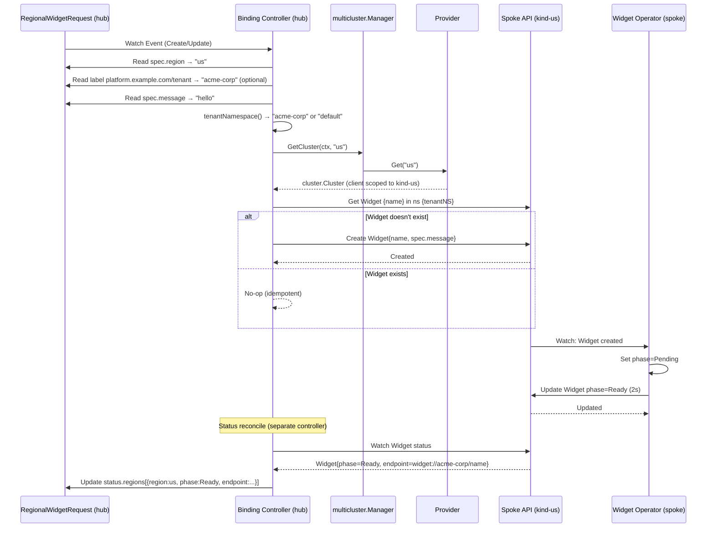

# Phase 5 — Binding Controller

The binding controller (`platform-mvp/binding-controller/`) is the hub-side reconciler that bridges the declarative `RegionalWidgetRequest` on the hub to concrete `Widget` instances on spoke clusters.

---

## Reconciliation Flow



## Controller Architecture

The binding-controller registers **two** controllers on the hub's multicluster manager:

1. **`regionalwidgetrequest`** (`controller/reconciler.go:43-49`) — watches `RegionalWidgetRequest` on the hub's **local** manager only:
   ```go
   ctrl.NewControllerManagedBy(r.Manager.GetLocalManager())
       .For(&unstructured.Unstructured{...RegionalWidgetRequest GVK...})
   ```

2. **`regionalwidgetrequest-status`** (`controller/reconciler.go:60-70`) — watches `Widget` status on the **spoke** cluster and updates the hub-side `RegionalWidgetRequest` status:
   ```go
   ctrl.NewControllerManagedBy(r.Manager.GetCluster(ctx, region))
       .WatchesRawSource(source.Kind(...Widget GVK...))
   ```

This two-controller pattern ensures the hub always reflects the true state of spoke-side resources.

## Tenant Isolation

The `tenantNamespace()` function (`controller/reconciler.go:98-106`) determines the spoke-side namespace by reading the `platform.example.com/tenant` label:

```go
func tenantNamespace(obj *unstructured.Unstructured) string {
    labels := obj.GetLabels()
    if labels != nil {
        if tenantID, ok := labels["platform.example.com/tenant"]; ok && tenantID != "" {
            return tenantID
        }
    }
    return widgetNamespace  // "default"
}
```

| Scenario | `platform.example.com/tenant` label | Widget Namespace |
|----------|--------------------------------------|-------------------|
| Multi-tenant | `acme-corp` | `acme-corp` |
| No tenant (legacy) | (absent) | `default` |

See [Phase 9 — Multi-Tenancy](09-multi-tenancy.md) for full details on spoke-side tenant RBAC and namespace provisioning.

## Widget Creation

The `ensureWidget()` method (`controller/reconciler.go:106-130`) is idempotent:

1. `spokeClient.Get(ctx, name, widget)` — check if Widget exists
2. If not found → `spokeClient.Create(ctx, widget)` with `spec.message` from RWR
3. If found → **do nothing** (existing Widgets are not updated)

Widgets are never deleted by the binding-controller; that's managed by Kro's RGD lifecycle (deleting the GlobalWidget cascades to RWRs, which cascade via OwnerReferences).

## Deployment Modes

| Mode | Command | Multicast Provider |
|------|---------|-------------------|
| **In-cluster** | `make deploy-hub` | ClusterProfile-based provider (discovery loop) |
| **Local/dev** | `go run . --hub-kubeconfig ... --spoke-kubeconfig ...` | `staticProvider` (single hardcoded cluster named "us") |

The local mode's `staticProvider` is defined at `main.go:123-176`. It directly parses a kubeconfig file and calls `mgr.Engage(ctx, "us", cluster)` — bypassing the ClusterProfile discovery loop entirely.

## Dex Auth Plugin (Optional)

The binding-controller can optionally use Dex-issued tokens instead of static kubeconfigs for spoke access. This is enabled via `values.bindingController.dex.enabled=true` and uses the `dex-auth-plugin` exec credential plugin (`platform-mvp/dex-auth-plugin/main.go`):

```yaml
# chart/hub-services/templates/binding-controller.yaml:84-95
initContainers:
  - name: dex-auth-plugin
    image: sojoner/dex-auth-plugin:dev
    command: [cp, /dex-auth-plugin, /plugin/dex-auth-plugin]
```

The plugin implements `client.authentication.k8s.io/v1` ExecCredential protocol, using `client_credentials` grant to obtain tokens from Dex. This is disabled by default; the binding-controller uses static kubeconfigs for spoke access in the standard configuration.

## Acceptance

- A `RegionalWidgetRequest` on hub produces a `Widget` on the correct spoke
- The Widget transitions to `Ready` within 5 seconds
- Hub-side RWR status reflects spoke-side Widget state
- Tenant isolation routes Widgets to the correct namespace
- `06-binding-controller` Chainsaw test passes

## Key Files

| File | Purpose |
|------|---------|
| `platform-mvp/binding-controller/main.go` | Entrypoint, provider setup, manager wiring |
| `platform-mvp/binding-controller/controller/reconciler.go` | Reconciliation logic, tenantNamespace(), ensureWidget() |
| `platform-mvp/binding-controller/controller/reconciler_test.go` | Unit tests |
| `platform-mvp/binding-controller/Dockerfile` | Multi-stage Docker build |
| `platform-mvp/dex-auth-plugin/main.go` | Exec credential plugin (optional Dex auth) |
| `chart/hub-services/templates/binding-controller.yaml` | Deployment + RBAC (SA, ClusterRole, ClusterRoleBinding, Service) |