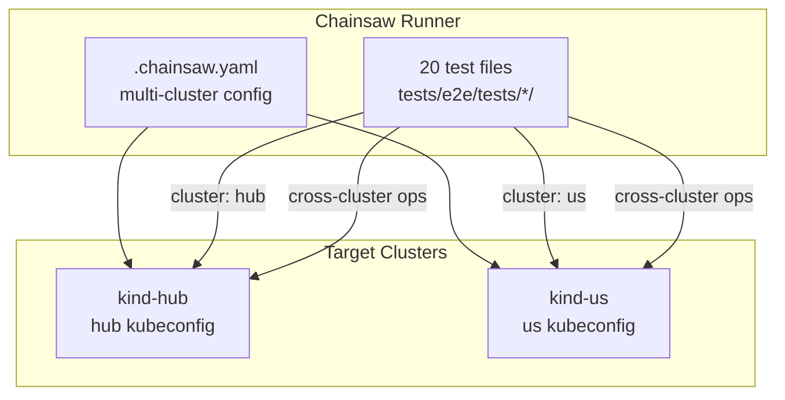
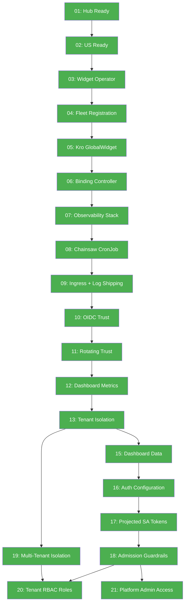
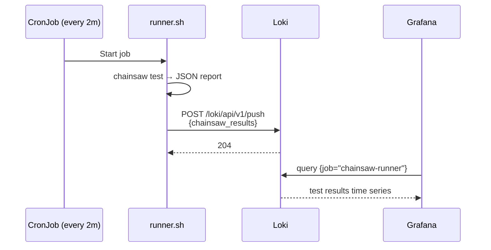

# Phase 6 — E2E Verification

All 20 Chainsaw E2E tests, run via `make validate`. Tests are declarative YAML files under `tests/e2e/tests/`.

---

## Test Architecture



Multi-cluster configuration in `tests/e2e/.chainsaw.yaml`:

```yaml
clusters:
  hub:
    kubeconfig: ./kubeconfig-hub
  us:
    kubeconfig: ./kubeconfig-us-internal
```

Each test specifies its target cluster via `cluster: hub` or `cluster: us`. Cross-cluster tests use script steps to execute `kubectl` on both clusters.

---

## All 20 Tests

| # | Test | Cluster | What It Validates |
|---|------|---------|-------------------|
| 01 | `hub-cluster-ready` | hub | Hub control-plane node is Ready; core pods running |
| 02 | `us-cluster-ready` | us | Us control-plane + workers Ready; core pods running |
| 03 | `widget-operator-healthy` | us | Widget CRD registered; widget-operator deployment Available; Widget reconciler running |
| 04 | `fleet-registered` | hub | ClusterProfile/us exists; multicluster provider engaged the spoke |
| 05 | `kro-globalwidget-rgd` | hub | Kro RGD registered; creating GlobalWidget{regions:[us]} produces RegionalWidgetRequest |
| 06 | `binding-controller-status-roundtrip` | hub→us | Binding-controller creates Widget on spoke; Widget → Ready; RWR status reflects spoke state |
| 07 | `observability-stack-healthy` | hub | Prometheus, Grafana, Loki pods Ready; all ServiceMonitors present |
| 08 | `chainsaw-cronjob-running` | hub | CronJob scheduled; previous job completed successfully |
| 09 | `ingress-and-log-shipping` | hub | Dex + Grafana ingresses exist with TLS; Event Exporter routes K8s events to Loki |
| 10 | `oidc-trust` | hub→us | Dex IDP healthy; OIDC discovery; JWT issuance; JWKS serving; oidc-verifier cross-cluster JWT validation; AUDIT trail |
| 11 | `rotating-trust` | hub→us | **v2**: Projected SA token volume in binding-controller; Dex retained for human OIDC |
| 12 | `dashboard-metrics` | hub | Prometheus returns data for binding-controller metrics via PromQL queries |
| 13 | `tenant-namespace-isolation` | hub→us | RWR with `label platform.example.com/tenant=acme-corp` → Widget created in `acme-corp` ns on spoke; NOT in default ns |
| 15 | `dashboard-data-rendering` | hub | Grafana dashboards render data for cluster-fitness and controller-deep-dive panels via port-forwarded PromQL queries |
| 16 | `auth-configuration` | us | **v2**: Spoke kube-apiserver uses AuthenticationConfiguration; dual-issuer (hub + Dex); no legacy oidc-* flags |
| 17 | `projected-sa-tokens` | hub→us | **v2**: Hub OIDC discovery; binding-controller projected token volume with correct audience; spoke trust setup |
| 18 | `admission-guardrails` | us | **v2**: Three ValidatingAdmissionPolicy resources exist and are bound; platform-admin RBAC present
| 19 | `multi-tenant-isolation` | hub→us | Cross-tenant isolation (acme-corp | globex-inc)
| 20 | `tenant-rbac-roles` | hub→us | Admin/dev/analyst role enforcement per tenant
| 21 | `platform-admin-access` | hub | Platform admin bypasses admission policies

---

## Test Flow Map



Tests are ordered to form a dependency chain: earlier tests deploy resources that later tests depend on.

---

## Running Tests

```bash
# Full suite (all 20 tests)
make validate

# Or directly:
cd tests/e2e
chainsaw test . --test-dir tests

# Single test
chainsaw test . --test-dir tests/10-oidc-trust

# Subset (admission + tenant isolation)
chainsaw test . --test-dir tests/18-admission-guardrails --test-dir tests/19-multi-tenant-isolation --test-dir tests/20-tenant-rbac-roles --test-dir tests/21-platform-admin-access
```

## In-Cluster Continuous Testing

The **Chainsaw CronJob** (`chart/infrastructure/templates/chainsaw-cronjob.yaml`) runs the full suite every 2 minutes and pushes JSON results to Loki. The **Chainsaw Results** Grafana dashboard renders pass/fail trends over time.



## Test Design Patterns

| Pattern | Used In | Example |
|---------|---------|---------|
| **kubectl apply + assert** | 04, 05, 06, 13 | Apply a resource, assert it becomes Ready |
| **exec into pod** | 03 | `kubectl rollout status` inside cluster |
| **curl + JSON parse** | 09, 10, 12, 15 | Port-forward, HTTP query, JSON assertion |
| **port-forward for distroless** | 12, 15 | No `wget`/`curl` in container → use host port-forward |
| **multi-cluster script** | 06, 10, 11, 13 | Hub-side apply, spoke-side assert across kubeconfigs |
| **py inline URL encode** | 12, 15 | PromQL queries with special chars via `python3 urllib.parse.quote()` |

## Key Files

| File | Purpose |
|------|---------|
| `tests/e2e/.chainsaw.yaml` | Multi-cluster configuration (hub + us kubeconfigs) |
| `tests/e2e/tests/01-hub-cluster-ready/` | Hub readiness test |
| `tests/e2e/tests/02-us-cluster-ready/` | Us readiness test |
| `tests/e2e/tests/03-widget-operator-healthy/` | Widget operator test |
| `tests/e2e/tests/04-fleet-registration/` | Fleet registration test |
| `tests/e2e/tests/05-kro-globalwidget/` | Kro GlobalWidget RGD test |
| `tests/e2e/tests/06-binding-controller/` | Binding controller roundtrip test |
| `tests/e2e/tests/07-observability-stack/` | Observability stack health test |
| `tests/e2e/tests/08-chainsaw-cronjob/` | CronJob test |
| `tests/e2e/tests/09-ingress-log-shipping/` | Ingress + log shipping test |
| `tests/e2e/tests/10-oidc-trust/` | OIDC trust test |
| `tests/e2e/tests/11-rotating-trust/` | v2 rotating trust test (projected SA volumes) |
| `tests/e2e/tests/12-dashboard-metrics/` | Dashboard metrics test |
| `tests/e2e/tests/13-tenant-isolation/` | Tenant isolation test |
| `tests/e2e/tests/15-dashboard-data/` | Dashboard data rendering test |
| `tests/e2e/tests/16-auth-configuration/` | AuthenticationConfiguration validation (v2) |
| `tests/e2e/tests/17-projected-sa-tokens/` | Projected SA token cross-cluster flow (v2) |
| `tests/e2e/tests/18-admission-guardrails/` | ValidatingAdmissionPolicy enforcement (v2)
| `tests/e2e/tests/19-multi-tenant-isolation/` | Cross-tenant isolation test (acme-corp \| globex-inc)
| `tests/e2e/tests/20-tenant-rbac-roles/` | Admin/dev/analyst role enforcement per tenant
| `tests/e2e/tests/21-platform-admin-access/` | Platform admin bypasses admission policies | |