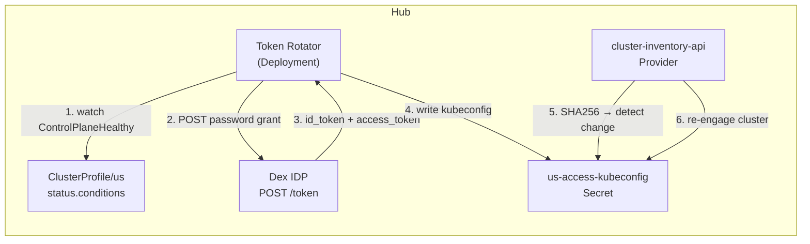
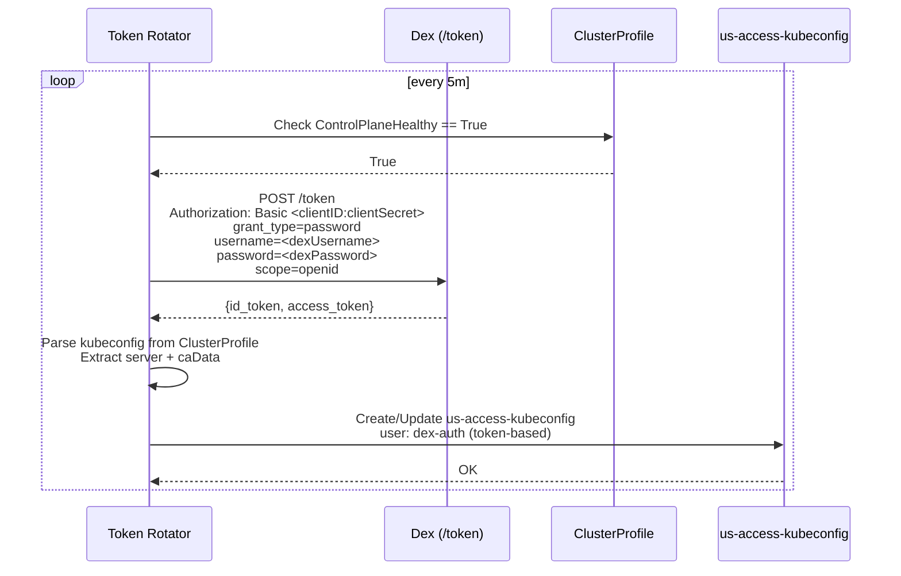
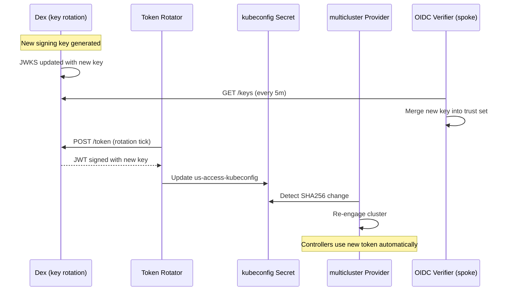

# Phase 7 — Token Rotator

> **REMOVED (2026-07-14):** The token-rotator code, Helm template, and all wiring were deleted from the repo — it is no longer buildable or deployable. Controller authentication uses projected ServiceAccount tokens. This document is retained for historical reference only; file paths and line numbers below no longer resolve.

The token-rotator (`platform-mvp/token-rotator/`) is a hub-side controller that continuously refreshes spoke cluster kubeconfigs using Dex-issued OIDC tokens. This decouples spoke access from long-lived static credentials and enables **zero-touch credential rotation**.

---

## Architecture



## Authentication Flow

The token-rotator uses Dex's **Resource Owner Password Credentials** grant (`platform-mvp/token-rotator/controller/reconciler.go:194-231`):



**Key details** (`controller/reconciler.go`):

- **Client ID resolution** (`reconciler.go:104-109`): Uses `dexClientIDTemplate` (default `{region}-spoke-controller`) → resolves to `us-spoke-controller`
- **Dex client secret**: Passed via `--dex-client-secret` flag or `DEX_CLIENT_SECRET` env var (`main.go:32-38`)
- **Kubeconfig assembly** (`reconciler.go:251-299`): Extracts `server` and `certificateAuthorityData` from `ClusterProfile.status.accessProviders[*].cluster`; falls back to parsing existing kubeconfig Secret
- **OwnerReference** (`reconciler.go:149-161`): The `us-access-kubeconfig` Secret has an OwnerReference to the ClusterProfile, so cleanup is automatic

## Health Gate

Rotation only proceeds when the ClusterProfile reports healthy (`controller/reconciler.go:233-249`):

```go
func isReady(cp *unstructured.Unstructured) bool {
    condition := getCondition(cp, "ControlPlaneHealthy")
    return condition != nil && condition["status"] == "True"
}
```

If `ControlPlaneHealthy` is not `True`, the reconciler **requeues after 30 seconds** without attempting rotation (`reconciler.go:127-130`).

## Provider Integration

The `cluster-inventory-api` provider (`providers/cluster-inventory-api/provider.go:136-222`) watches the `us-access-kubeconfig` Secret for changes during its poll loop:

1. **SHA256 hash** of kubeconfig bytes is computed each poll cycle
2. If hash changed → call `disengageCluster()` to cancel the old cluster context, then re-engage with new kubeconfig
3. **Index fields are replayed** against the new cluster (`provider.go:200-202`)
4. This means **controllers automatically pick up the new credentials** without restart

## Metrics

Exposed on `:8080/metrics`, scraped by Prometheus every 15s via ServiceMonitor (`chart/hub-services/templates/servicemonitors.yaml:21-36`).

| Metric | Type | Labels | Description |
|--------|------|--------|-------------|
| `token_rotator_rotations_total` | CounterVec | `region`, `result` | Total rotations (result = success/error) |
| `token_rotator_rotation_errors_total` | CounterVec | `region`, `error_type` | Errors by type (token_fetch, secret_update, secret_create) |
| `token_rotator_last_rotation_timestamp_seconds` | GaugeVec | `region` | Unix timestamp of last successful rotation |

Defined in `controller/metrics.go:10-34`.

## Rotating Trust

The token-rotator enables a **rotating trust** model where spoke kubeconfigs are ephemeral (Dex tokens have configurable expiry). Combined with Dex key rotation and oidc-verifier JWKS polling, credentials never stay static:



**Test coverage**:
- `11-rotating-trust` — v2: Verifies projected SA token volume in binding-controller + token-rotator disabled + Dex retained for human OIDC

## Deployment

Packaged in the hub Helm chart at `chart/hub-services/templates/token-rotator.yaml`:

```yaml
# Lines 1-85: ServiceAccount + ClusterRole + ClusterRoleBinding + Deployment + Service
```

Key RBAC permissions:
- `get/list/watch` `ClusterProfile` (multicluster.x-k8s.io)
- `get/create/update` Secrets (default namespace)
- `get/list/watch` Deployments (for health status)

Values configuration (`chart/infrastructure/values.yaml:73-87`):

```yaml
tokenRotator:
  dexClientIDTemplate: "{region}-spoke-controller"
  dexClientSecret: changeme
  dexUsername: admin@example.com
  dexPassword: admin
  dexIssuer: http://dex.monitoring.svc.cluster.local:5556/dex
```

The `dexClientIDTemplate` is a Go template string where `{region}` is replaced with the ClusterProfile name (e.g., `us`, `eu`, `asia`).