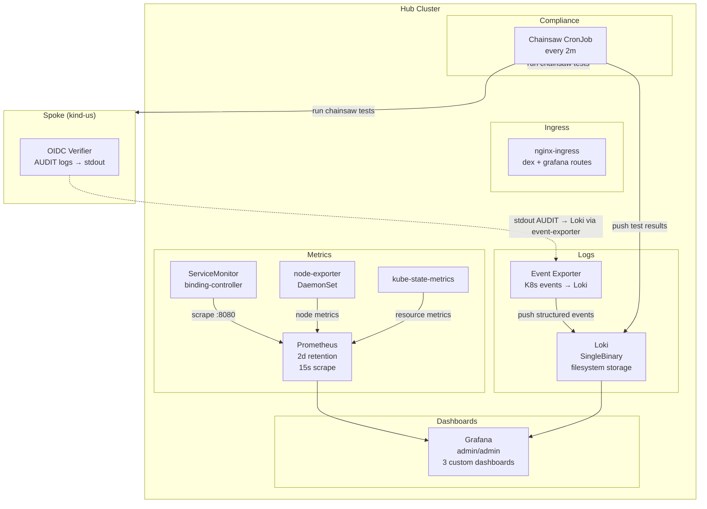
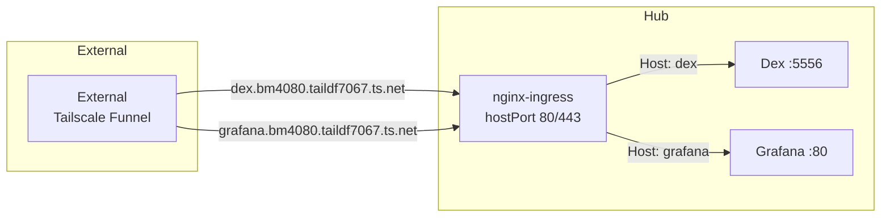
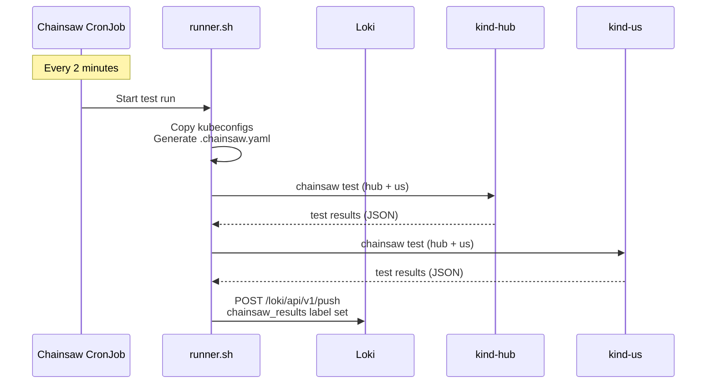
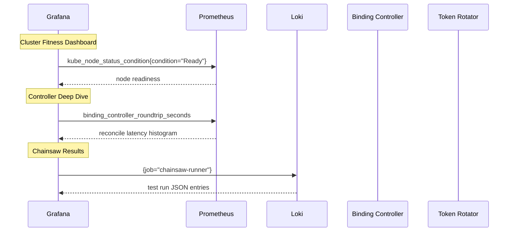

# Phase 8 — Observability Stack

The observability layer provides metrics, logging, dashboards, and continuous compliance validation on the hub cluster. It is deployed as part of the hub Helm chart with Flux-managed Helm sub-charts for Prometheus, Loki, and ingress-nginx.

---

## Component Architecture



## Prometheus

Deployed via `kube-prometheus-stack` Helm chart (`chart/infrastructure/values.yaml`, `kube-prometheus-stack:` key):

| Setting | Value |
|---------|-------|
| Replicas | 1 |
| Retention | 2 days |
| Scrape interval | 30s |
| ServiceMonitor selector | `{}` (all ServiceMonitors) |
| Storage | Empty (no PVC) |

### ServiceMonitors

One custom ServiceMonitor in `chart/hub-services/templates/servicemonitors.yaml`:

- **binding-controller**: scrapes `:8080/metrics` every 15s

Plus kube-prometheus-stack's built-in ServiceMonitors for core Kubernetes components.

## Grafana

Deployed as part of `kube-prometheus-stack`:

- **Credentials**: `admin` / `admin` (values.yaml lines 29-31)
- **Loki datasource**: Pre-configured at `http://loki.monitoring:3100` (values.yaml lines 40-49)
- **Custom dashboards** (mounted from ConfigMaps via `chart/infrastructure/templates/dashboards.yaml`):

| Dashboard | ConfigMap | Purpose |
|-----------|-----------|---------|
| Chainsaw Results | `grafana-dashboard-chainsaw-results` | E2E test pass/fail trends over time |
| Cluster Fitness | `grafana-dashboard-cluster-fitness` | Node readiness, pod health, resource utilization |
| Controller Deep Dive | `grafana-dashboard-controller-deep-dive` | Binding controller reconcile latency, regional distribution |

## Loki

Deployed via `grafana/loki` Helm chart (`chart/infrastructure/values.yaml`, `loki:` key):

| Setting | Value |
|---------|-------|
| Mode | SingleBinary |
| Storage | Filesystem (`/var/loki`) |
| Persistence | Disabled (kind dev) |
| Schema | TSDB v13, 24h index period |
| Auth | Disabled |

### Event Exporter — Log Shipping

The `kubernetes-event-exporter` (`chart/infrastructure/templates/event-exporter.yaml:21`) replaces promtail for Kubernetes events. It watches all namespaces and sends structured events to Loki:

```yaml
# Lines 41-62: Loki receiver config
receivers:
  - name: loki
    loki:
      url: http://loki.monitoring:3100/loki/api/v1/push
      labels:
        involved_kind: "{{ .InvolvedObject.Kind }}"
        involved_name: "{{ .InvolvedObject.Name }}"
        reason: "{{ .Reason }}"
        type: "{{ .Type }}"
        namespace: "{{ .Namespace }}"
```

**Note on promtail**: The architecture originally planned to use `promtail` for log shipping (including oidc-verifier AUDIT logs), but the production deployment uses `kubernetes-event-exporter` for Kubernetes event routing to Loki. The oidc-verifier's structured `AUDIT` log lines to stdout are not currently shipped to Loki — this is a known gap for future iteration. See `chart/infrastructure/values.yaml` (`promtail:` key) for the promtail configuration that would be used when this is enabled.

## Ingress (nginx)

Deployed via `ingress-nginx/ingress-nginx` Helm chart (`chart/infrastructure/values.yaml`, `ingress-nginx:` key):

- **HostPort** (kind): 80 + 443 on hub control-plane node
- **Routes**: `dex.example.com` → Dex service, `grafana.example.com` → Grafana service
- **TLS**: cert-manager self-signed certificates (dev only)



## Chainsaw CronJob — Continuous Compliance

A `CronJob` (`chart/infrastructure/templates/chainsaw-cronjob.yaml:1-84`) runs the full E2E test suite every 2 minutes against both clusters:



**Runner details** (`deploy/platform-mvp/observability/runner.sh`):

1. Copies `hub` and `us-internal` kubeconfigs to working dir (lines 35-36)
2. Generates `.chainsaw.yaml` with multi-cluster config (lines 38-62)
3. Runs `chainsaw test` with JSON report output (lines 67-75)
4. Pushes results to Loki as structured log entries (lines 98-110)

**Docker image** (`Dockerfile.chainsaw-runner`): Alpine 3.21 with `kubectl`, `chainsaw`, `curl`, `jq`, `bash`, `coreutils`, `sed`.

## Dashboard Data Flow



---

## Testing

| Test | What It Validates |
|------|-------------------|
| `07-observability-stack` | Prometheus, Grafana, Loki pods are Ready; all ServiceMonitors exist |
| `08-chainsaw-cronjob` | CronJob exists, is scheduled, previous job completed |
| `09-ingress-log-shipping` | Dex + Grafana ingresses exist with TLS; Event Exporter routes events to Loki |
| `12-dashboard-metrics` | Prometheus returns data for binding-controller metrics |
| `15-dashboard-data` | Grafana dashboards render data for cluster-fitness and controller-deep-dive panels via port-forward queries to Prometheus |

## Key Files

| File | Purpose |
|------|---------|
| `chart/infrastructure/values.yaml` (`kube-prometheus-stack:` key) | Prometheus + Grafana Helm values |
| `chart/infrastructure/values.yaml` (`loki:` key) | Loki SingleBinary Helm values |
| `chart/infrastructure/values.yaml` (`ingress-nginx:` key) | nginx-ingress Helm values |
| `observability/runner.sh` | Chainsaw runner entrypoint |
| `observability/Dockerfile.chainsaw-runner` | Runner image build |
| `chart/hub-services/templates/servicemonitors.yaml` | ServiceMonitor CRD for binding-controller |
| `chart/infrastructure/templates/event-exporter.yaml` | Event Exporter Deployment + ConfigMap |
| `chart/infrastructure/templates/chainsaw-cronjob.yaml` | Chainsaw CronJob |
| `chart/infrastructure/templates/dashboards.yaml` | Grafana dashboard ConfigMaps |
| `chart/infrastructure/dashboards/*.json` | Dashboard JSON definitions |
