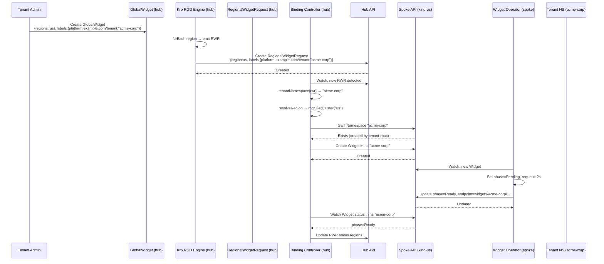
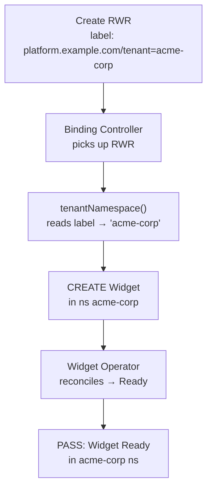

# Phase 9 — Multi-Tenancy

Multi-tenancy isolates workloads by tenant through a `platform.example.com/tenant` label on `RegionalWidgetRequest`, namespace-scoped Widget creation on the spoke, and spoke-side tenant RBAC with admin/developer/analyst role tiers.

---

## Data Model

The `RegionalWidgetRequest` CRD (`deploy/platform-mvp/chart/crds/templates/regionalwidgetrequest-crd.yaml`) defines only `spec.region` and `spec.message` — there is no `spec.tenant` field. Instead, the tenant is identified by the `platform.example.com/tenant` label on `metadata.labels`:

```yaml
metadata:
  labels:
    platform.example.com/tenant: acme-corp
```

The Kro `GlobalWidget` RGD (`deploy/platform-mvp/chart/hub-services/templates/kro-rgd.yaml:22-23`) passes the label through from the GlobalWidget to each emitted RegionalWidgetRequest:

```yaml
metadata:
  labels:
    platform.example.com/tenant: '${schema.metadata.labels["platform.example.com/tenant"]}'
```

This means a `GlobalWidget` like:

```yaml
apiVersion: platform.example.com/v1alpha1
kind: GlobalWidget
metadata:
  name: acme-production
  labels:
    platform.example.com/tenant: acme-corp
spec:
  regions: [us]
  message: "ACME production workload"
```

Produces a `RegionalWidgetRequest` in the binding-controller's watch namespace with label `platform.example.com/tenant = "acme-corp"`.

---

## Isolation Flow



## Binding Controller Logic

The tenant-to-namespace mapping lives in the binding controller's `tenantNamespace()` function (`platform-mvp/binding-controller/controller/reconciler.go:98-106`):

```go
func tenantNamespace(obj *unstructured.Unstructured) string {
    labels := obj.GetLabels()
    if labels != nil {
        if tenantID, ok := labels["platform.example.com/tenant"]; ok && tenantID != "" {
            return tenantID
        }
    }
    return widgetNamespace  // "default"
}
```

- If `platform.example.com/tenant` label is set → Widget is created in namespace `{label value}` (e.g., `acme-corp`, `globex-inc`)
- If no tenant label → Widget is created in `default` namespace (backward compatible)

## Spoke-Side Tenant RBAC

The spoke Helm chart provisions per-tenant resources via `chart/us/templates/tenant.yaml`, defining three role tiers per tenant:

| Role | Verbs | Typical User |
|------|-------|-------------|
| **admin** | `*` (full CRUD, including delete and `/status`) | alice@acme-corp.example.com / dave@globex-inc.example.com |
| **developer** | `get, list, watch, create, update, patch` (no delete) | bob@acme-corp.example.com / eve@globex-inc.example.com |
| **analyst** | `get, list, watch` (read-only) | carol@acme-corp.example.com / frank@globex-inc.example.com |

For each tenant defined in `values.tenants[]` (acme-corp and globex-inc), the chart creates:

```yaml
# Namespace
apiVersion: v1
kind: Namespace
metadata:
  name: {tenant.id}

# 3 Roles: {tenant}-admin, {tenant}-developer, {tenant}-analyst
# admin Role: verbs: ["*"] on widgets + widgets/status
# developer Role: verbs: ["get", "list", "watch", "create", "update", "patch"] on widgets
# analyst Role: verbs: ["get", "list", "watch"] on widgets

# 3 RoleBindings, each binding a dex: group to its role:
# {tenant}-admin-binding    → subjects: {kind: Group, name: dex:{tenant}-admin}
# {tenant}-developer-binding → subjects: {kind: Group, name: dex:{tenant}-developer}
# {tenant}-analyst-binding   → subjects: {kind: Group, name: dex:{tenant}-analyst}
```

Platform-wide, a `dex:platform-admin` group (user `admin@example.com`) has cluster-level privileges managed by ValidatingAdmissionPolicies, enforced on the spoke by default (`admissionPolicies.enabled: true`).

### Demo Users

| Email | Tenant | Role | Dex Group |
|-------|--------|------|-----------|
| admin@example.com | (platform) | platform-admin | platform-admin |
| alice@acme-corp.example.com | acme-corp | admin | acme-corp-admin |
| bob@acme-corp.example.com | acme-corp | developer | acme-corp-developer |
| carol@acme-corp.example.com | acme-corp | analyst | acme-corp-analyst |
| dave@globex-inc.example.com | globex-inc | admin | globex-inc-admin |
| eve@globex-inc.example.com | globex-inc | developer | globex-inc-developer |
| frank@globex-inc.example.com | globex-inc | analyst | globex-inc-analyst |

## Security Properties

| Property | How Enforced |
|----------|-------------|
| **Workload isolation** | Each tenant's Widgets live in a dedicated namespace; no cross-tenant access |
| **Network isolation** | Kind doesn't support NetworkPolicy, but namespaces provide logical separation |
| **RBAC isolation** | Per-tenant namespace with 3-tier role bindings (admin/dev/analyst); no cluster-wide Widget access |
| **Audit separation** | Widgets carry `platform.example.com/tenant` label on the RWR; event-exporter captures per-namespace events |
| **Admission policies** | ValidatingAdmissionPolicies on the spoke restrict ClusterRole management to `dex:platform-admin`; enabled by default |

## Testing

**Test 13 (`tenant-namespace-isolation`)** validates the label-based tenant isolation flow:

1. Creates a `RegionalWidgetRequest` on hub with `labels: {platform.example.com/tenant: "acme-corp"}` and `spec.region = "us"`
2. Waits for the binding-controller to create a `Widget` in the `acme-corp` namespace on the spoke
3. Verifies the Widget transitions to `phase=Ready`
4. Confirms metrics carry `tenant_id="acme-corp"` label



**Test 19 (`multi-tenant-isolation`)** validates cross-tenant access is denied:

1. Creates RWRs labeled for acme-corp and globex-inc on the hub
2. Confirms Widgets land in their respective namespaces (`acme-corp` and `globex-inc`)
3. Verifies acme-corp analyst cannot access globex-inc namespace (cross-tenant `forbidden`)
4. Verifies globex-inc analyst cannot access acme-corp namespace (cross-tenant `forbidden`)
5. Confirms binding-controller metrics carry correct `tenant_id` labels for both tenants

**Test 20 (`tenant-rbac-roles`)** validates the three role tiers on the spoke:

1. Developer can create, read, and update a Widget — but cannot delete (denied)
2. Analyst is denied create/update — but can read Widgets
3. Admin has full access, including delete

## Key Files

| File | Purpose |
|------|---------|
| `chart/crds/templates/regionalwidgetrequest-crd.yaml` | CRD definition (no `spec.tenant` — tenant is a label) |
| `platform-mvp/binding-controller/controller/reconciler.go:98-106` | `tenantNamespace()` — reads tenant from labels |
| `chart/us/templates/tenant.yaml` | Per-tenant Namespace + 3-tier Roles + RoleBindings |

| `chart/us/templates/admission-guardrails.yaml` | Admission policies enforced by default |
| `chart/us/values.yaml:73-77` | Tenant definitions (acme-corp, globex-inc) with 3 Dex groups each |
| `chart/infrastructure/templates/dex.yaml:68-110` | 7 demo users with group assignments |
| `tests/e2e/tests/13-tenant-isolation/chainsaw-test.yaml` | E2E test: label-based tenant isolation |
| `tests/e2e/tests/19-multi-tenant-isolation/chainsaw-test.yaml` | E2E test: cross-tenant access denied |
| `tests/e2e/tests/20-tenant-rbac-roles/chainsaw-test.yaml` | E2E test: role tier enforcement |