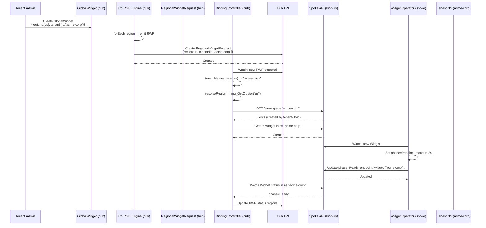
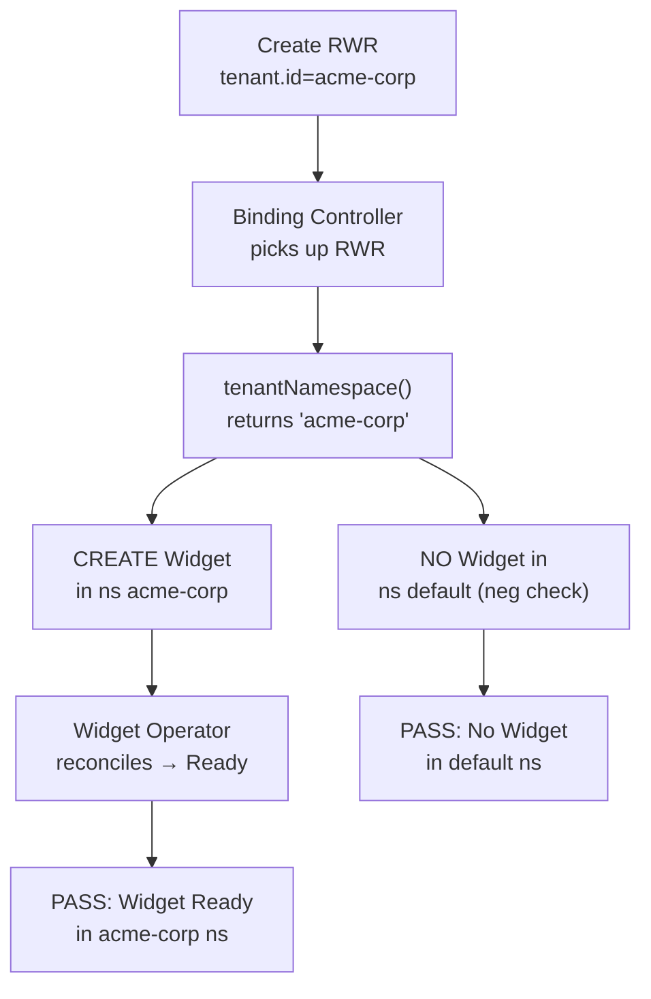

# Phase 9 — Multi-Tenancy

Multi-tenancy isolates workloads by tenant through a combination of the `tenant` field on `RegionalWidgetRequest`, namespace-scoped Widget creation on the spoke, and spoke-side tenant RBAC.

---

## Data Model

The `RegionalWidgetRequest` CRD (`deploy/platform-mvp/chart/hub/templates/regionalwidgetrequest-crd.yaml:40-45`) defines:

```yaml
tenant:
  type: object
  properties:
    id:
      type: string
      description: Tenant identifier used as spoke-side namespace for workload isolation
```

The Kro `GlobalWidget` RGD (`kro/globalwidget-rgd.yaml:25`) passes the tenant through:

```yaml
tenant: '${schema.spec.tenant}'
```

This means a `GlobalWidget` like:

```yaml
apiVersion: platform.example.com/v1alpha1
kind: GlobalWidget
metadata:
  name: acme-production
spec:
  regions: [us]
  message: "ACME production workload"
  tenant:
    id: acme-corp
```

Produces a `RegionalWidgetRequest` in the binding-controller's watch namespace with `spec.tenant.id = "acme-corp"`.

---

## Isolation Flow



## Binding Controller Logic

The tenant-to-namespace mapping lives in the binding controller's `tenantNamespace()` function (`platform-mvp/binding-controller/controller/reconciler.go:98-104`):

```go
func tenantNamespace(obj *unstructured.Unstructured) string {
    tenantID, found, _ := unstructured.NestedString(obj.Object, "spec", "tenant", "id")
    if found && tenantID != "" {
        return tenantID
    }
    return widgetNamespace  // "default"
}
```

- If `spec.tenant.id` is set → Widget is created in namespace `{tenant.id}`
- If no tenant → Widget is created in `default` namespace (backward compatible)

## Spoke-Side Tenant RBAC

The spoke Helm chart provisions per-tenant resources via `chart/us/templates/tenant-rbac.yaml`:

```yaml
# For each tenant defined in values.tenants[]:
apiVersion: v1
kind: Namespace
metadata:
  name: {tenant.id}

apiVersion: rbac.authorization.k8s.io/v1
kind: Role
metadata:
  name: widget-operator
  namespace: {tenant.id}
rules:
  - apiGroups: ["platform.example.com"]
    resources: ["widgets"]
    verbs: ["get", "list", "watch", "create", "update", "patch"]

apiVersion: rbac.authorization.k8s.io/v1
kind: RoleBinding
metadata:
  name: widget-operator
  namespace: {tenant.id}
subjects:
  - kind: ServiceAccount
    name: widget-operator
    namespace: default
roleRef:
  kind: Role
  name: widget-operator
```

This allows the widget-operator's ServiceAccount to manage Widgets in tenant-specific namespaces. New tenants are added by appending to `values.tenants[]`.

## Security Properties

| Property | How Enforced |
|----------|-------------|
| **Workload isolation** | Each tenant's Widgets live in a dedicated namespace; no cross-tenant access |
| **Network isolation** | Kind doesn't support NetworkPolicy, but namespaces provide logical separation |
| **RBAC isolation** | Widget operator SA has per-namespace RoleBindings; no cluster-wide Widget access |
| **Audit separation** | Widgets carry tenant.name in metadata; event-exporter captures per-namespace events |

## Testing

**Test 13 (`tenant-namespace-isolation`)** validates the full tenant isolation flow:

1. Creates a `RegionalWidgetRequest` on hub with `spec.tenant.id = "acme-corp"` and `spec.region = "us"`
2. Waits for the binding-controller to create a `Widget` in the `acme-corp` namespace on the spoke
3. Verifies the Widget transitions to `phase=Ready`
4. Confirms the Widget is **not** created in the `default` namespace (negative assertion)



---

## Extending Tenants

To add a new tenant (e.g., `globex-inc`):

1. **Spoke RBAC** — Add to `chart/us/values.yaml`:
   ```yaml
   tenants:
     - id: acme-corp
     - id: globex-inc   # new
   ```

2. **Create GlobalWidget with tenant**:
   ```yaml
   spec:
     tenant:
       id: globex-inc
   ```

The binding-controller automatically routes Widgets to `globex-inc` namespace. No code changes required.

## Key Files

| File | Purpose |
|------|---------|
| `chart/hub/templates/regionalwidgetrequest-crd.yaml:40-45` | CRD `tenant` field definition |
| `platform-mvp/binding-controller/controller/reconciler.go:98-104` | `tenantNamespace()` — tenant→namespace mapping |
| `chart/us/templates/tenant-rbac.yaml` | Per-tenant Namespace + Role + RoleBinding |
| `kro/globalwidget-rgd.yaml:25` | RGD template `tenant` passthrough |
| `tests/e2e/tests/13-tenant-isolation/chainsaw-test.yaml` | E2E test |