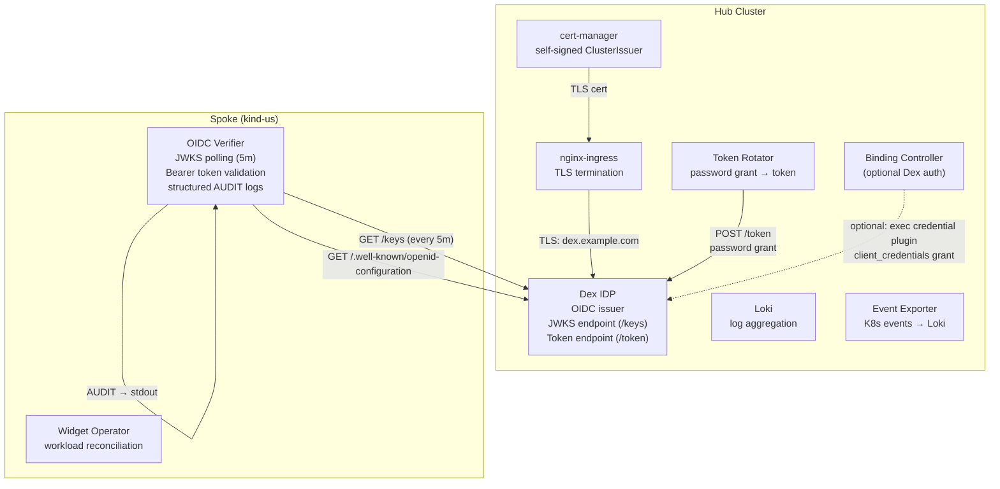
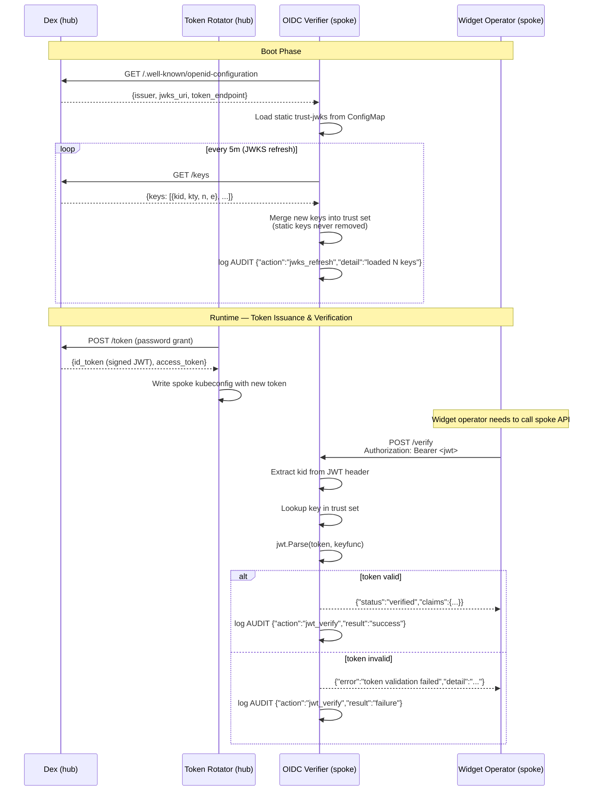
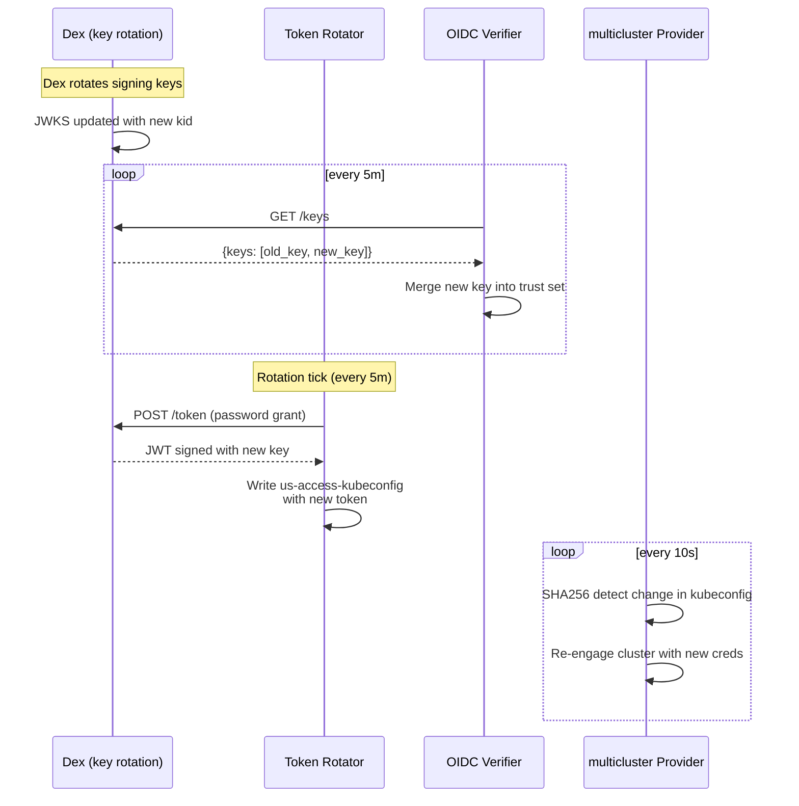

# Phase 10 — OIDC Cross-Cluster Trust

Dex IDP on the hub issues signed JWTs that the oidc-verifier on the spoke validates against Dex's JWKS endpoint. This creates a parallel trust layer for application workloads — complementary to the binding-controller's X.509/kubeconfig auth.

---

## Trust Architecture



---

## OIDC Trust Lifecycle



---

## Component Details

### Dex IDP (Hub)

Deployed via `chart/hub/templates/dex.yaml`:

| Setting | Value |
|---------|-------|
| **Issuer** | `http://dex.monitoring.svc.cluster.local:5556/dex` (cluster-internal) or Tailscale Funnel URL (external) |
| **Storage** | SQLite (`/var/dex/dex.db`) |
| **OAuth2 flows** | authorization_code, implicit, password, client_credentials |
| **Static clients** | `widget-controller`, `chainsaw-test-client`, infrastructure per-region clients, tenant clients |
| **Password connector** | `mockPassword` (admin@example.com / admin) |

**Infrastructure clients** (`chart/hub/values.yaml:16-33`): `us-spoke-controller`, `eu-spoke-controller`, `asia-spoke-controller` — each with `client_credentials` grant for the token-rotator's per-region authentication.

**Tenant clients** (`chart/hub/values.yaml:37-52`): `acme-corp-us-controller` — workload-level Dex clients for tenant-scoped access.

### OIDC Verifier (Spoke)

Deployed via `chart/us/templates/oidc-verifier.yaml`:

- **Endpoints**: `/healthz` (liveness), `/verify` (token validation)
- **JWKS refresh**: Every 5 minutes in a background goroutine (`main.go:65-72`)
- **Key types supported**: RSA (RS256/384/512) and EC (ES256/384/512, P-256/P-384/P-521)
- **Trust bootstrapping**: Loads static JWKS from `--trust-jwks` file (mounted from ConfigMap `oidc-verifier-trust-jwks`)
- **Key merge strategy** (`main.go:207-209`): Keys from Dex's JWKS are **merged** into the existing trust set; static keys are never removed

### Structured Audit Trail

All verification attempts emit structured JSON audit logs to stdout (`main.go:270-281`):

```json
AUDIT {"timestamp":"2026-07-11T18:23:39Z","action":"jwks_refresh","subject":"system","result":"success","detail":"loaded 1 keys","component":"oidc-verifier"}
AUDIT {"timestamp":"2026-07-11T18:23:40Z","action":"jwt_verify","subject":"widget-controller","result":"success","detail":"token validated","component":"oidc-verifier"}
```

**Subject extraction** (`main.go:253-268`): Parses the JWT (unverified) to extract `sub` or `client_id` claim.

**Log shipping**: The architecture originally planned to use `promtail` (DaemonSet) to ship oidc-verifier stdout audit logs to Loki. The current deployment uses `kubernetes-event-exporter` for Kubernetes event routing. Shipping oidc-verifier AUDIT logs directly to Loki is a planned enhancement — the promtail Helm values are defined at `deploy/platform-mvp/observability/promtail-values.yaml` but are currently disabled.

---

## Rotating Trust Integration

The token-rotator couples with OIDC trust to create a **rotating credentials model**:



See [Phase 7 — Token Rotator](07-token-rotator.md) for the full rotation lifecycle.

---

## Novelties

| Property | Mechanism |
|----------|-----------|
| **Workload identity without kubeconfigs** | Dex-issued JWTs serve as application credentials; oidc-verifier validates them without static certs |
| **JWKS-based cross-cluster trust** | Spoke trusts hub's identity provider by polling its public key endpoint — no secret sharing |
| **Structured audit trail** | Every JWT verification attempt is logged as structured JSON → queryable via Loki → Grafana |
| **Declarative trust composition** | Trust keys are expressed as ConfigMap resources; new trust anchors added without code changes |
| **Rotating credentials** | Token-rotator + multiplexed provider ensures kubeconfig tokens are ephemeral; no restarts needed |

---

## Testing

| Test | What It Validates |
|------|-------------------|
| `10-oidc-trust` | Dex deployment healthy; OIDC discovery endpoint; JWT issuance; JWKS endpoint; oidc-verifier running; cross-cluster JWT verification; AUDIT trail present (7 steps) |
| `11-rotating-trust` | Dex `trust-jwks` ConfigMap present on spoke; oidc-verifier mounts trust keys; keys can be rotated declaratively |

## Key Files

| File | Purpose |
|------|---------|
| `chart/hub/templates/dex.yaml` | Dex Deployment + ConfigMap + RBAC + Service (180 lines) |
| `platform-mvp/oidc-verifier/main.go` | OIDC verifier: JWKS polling, JWT validation, audit logging |
| `chart/us/templates/oidc-verifier.yaml` | oidc-verifier Deployment on spoke |
| `chart/hub/templates/cert-manager.yaml` | Self-signed ClusterIssuer for TLS |
| `chart/hub/templates/dex-ingress.yaml` | Dex ingress (TLS via cert-manager) |
| `deploy/platform-mvp/observability/promtail-values.yaml` | Promtail config (for future log shipping) |
| `tests/e2e/tests/10-oidc-trust/chainsaw-test.yaml` | OIDC trust E2E test (7 steps) |
| `tests/e2e/tests/11-rotating-trust/chainsaw-test.yaml` | Rotating trust E2E test |