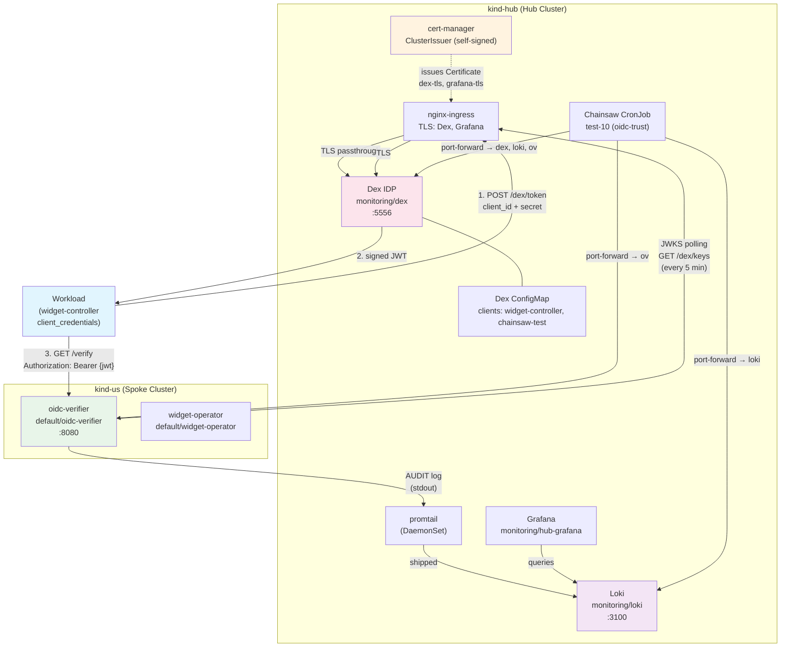
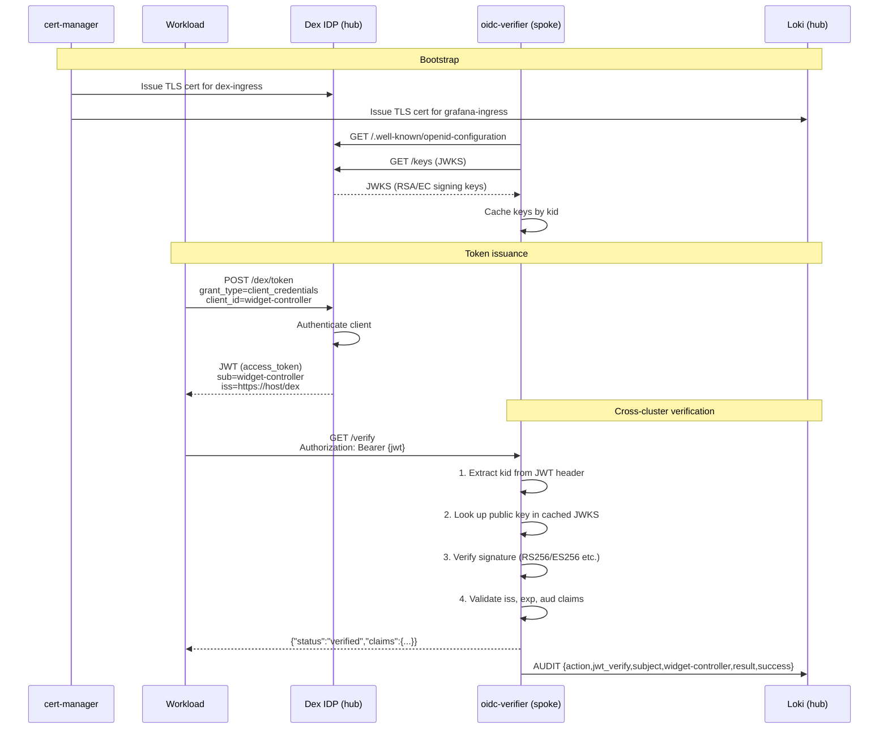
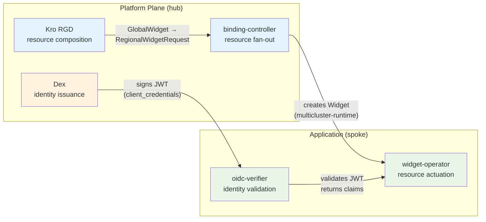

# 10 — Multi-Cluster OIDC Trust

## Goal

Add a cross-cluster OIDC trust layer on top of the existing multi-cluster platform.
Dex IDP on the hub issues signed JWTs; workload consumers on spoke clusters validate
them against Dex's JWKS endpoint — proving **workload identity propagation** across
cluster boundaries with full audit trail.

## What's new

| Layer | Component | Cluster | Purpose |
|-------|-----------|---------|---------|
| TLS PKI | cert-manager + self-signed ClusterIssuer | hub | TLS for Dex, Grafana ingresses |
| Identity | Dex IDP (v2.42.0, SQLite) | hub | OIDC issuer, client_credentials + auth code grants |
| Verification | oidc-verifier (Go, JWKS polling) | us | Validates hub-issued JWTs, emits AUDIT logs |
| Audit | promtail → Loki | hub | Ships oidc-verifier stdout to Loki |
| Test | Chainsaw test-10 | hub CronJob | Proves full OIDC lifecycle end-to-end |

**This does NOT replace the existing binding-controller auth (X.509/kubeconfig).**
OIDC is a parallel trust layer for **application workloads** — services that don't
have kubeconfig access but carry a JWT issued by the platform's IDP.

## Architecture

### Component diagram



### Sequence diagram — OIDC trust lifecycle



### Kro + multicluster-runtime: the OIDC angle

The existing platform fan-out pattern (Kro RGD → GlobalWidget → RegionalWidgetRequest →
binding-controller → Widget on spoke) already proves **resource orchestration** across
clusters.  OIDC adds the **identity plane** on top:



**Novelties**:

1. **Workload identity without kubeconfigs.** The `client_credentials` grant lets
   workloads authenticate as `widget-controller` using a client secret (or
   eventually a signed assertion), not a kubeconfig file. This is how service
   accounts work in cloud-native OIDC — no cluster-admin needed.

2. **Cross-cluster trust is JWKS-based.** The spoke's oidc-verifier doesn't need
   shared secrets or VPN to trust the hub. It polls the public JWKS endpoint
   every 5 minutes. If the hub rotates signing keys, the spoke picks them up
   automatically.

3. **Audit trail in logs.** Every verification attempt — success or failure —
   emits a structured `AUDIT` log line to stdout. promtail ships that to Loki,
   and Grafana can query it. This is the foundation for compliance dashboards.

4. **Kro composes resources, OIDC composes trust.** Kro lets you define
   `GlobalWidget → RegionalWidgetRequest` as a templated expansion. OIDC lets you
   define `Dex Client → JWT → oidc-verifier` as a trust chain. Both follow the
   same declarative pattern: define the intent, let the runtime handle it.

### Possibilities with multi-cluster OIDC runtime

| Pattern | How it works | Demo-ready |
|---------|-------------|------------|
| **API keys as workload identities** | Dex static client → `client_credentials` → JWT (already implemented) | Yes |
| **User authentication** | Dex mockPassword connector → auth code flow → id_token | Yes (chainsaw-test-client) |
| **Token exchange across regions** | Hub Dex is the single issuer; every spoke verifies the same JWKS endpoint | Yes |
| **Key rotation** | Dex rotates signing keys; oidc-verifier auto-refreshes JWKS every 5 minutes | Yes |
| **Federated identity** | Dex supports upstream connectors (GitHub, LDAP, OIDC providers) — swap `mockPassword` for a real connector | Extendable |
| **mTLS + JWT dual auth** | nginx ingress already has TLS (cert-manager); add client-cert verification as a second authentication layer | Extendable |
| **Per-workload RBAC on spoke** | oidc-verifier returns verified claims; spoke operators can use `sub`/`client_id` for authorization decisions | Extendable |
| **Audit dashboards** | All oidc-verifier AUDIT logs flow to Loki; build a Grafana dashboard showing authentication trends | Extendable |

## Implementation details

### Dex (hub)

- **Image**: `ghcr.io/dexidp/dex:v2.42.0`
- **Storage**: SQLite (`/var/dex/dex.db` in an emptyDir volume)
- **Static clients**:
  - `widget-controller` (confidential, client_credentials grant) — workload identity
  - `chainsaw-test-client` (public, auth code grant) — test harness
- **Connector**: mockPassword (`admin@example.com` / `admin`)
- **Ingress**: `dex-ingress` with TLS certificate from cert-manager
- **OIDC discovery**: `/.well-known/openid-configuration` at the Dex service root

### oidc-verifier (spoke)

- **Language**: Go, `golang-jwt/jwt/v5`
- **Endpoints**:
  - `GET /healthz` — returns `{"status":"ok"}` if JWKS is loaded
  - `GET /verify` — validates `Authorization: Bearer {jwt}`, returns `{status, claims}`
- **JWKS refresh**: On startup, then every 5 minutes
- **Supported algorithms**: RS256, RS384, RS512, ES256, ES384, ES512
- **Verification steps**:
  1. Extract `kid` from JWT header
  2. Look up public key in cached JWKS (keyed by `kid`)
  3. Verify cryptographic signature
  4. Validate `iss` (must match Dex issuer), `exp`, `aud` (if configured)
- **Audit logging**: Structured JSON to stdout, formatted as `AUDIT {…}`
- **Deployment**: 1 replica, 10m CPU / 16Mi RAM, ClusterIP service on :8080

### cert-manager

- **Version**: v1.17.1
- **ClusterIssuer**: `selfsigned-issuer` (self-signed, for local dev)
- **Certificates**: `dex-tls` and `grafana-tls`, stored as Kubernetes TLS secrets

### Chainsaw test-10 (`10-oidc-trust`)

7 steps executed from the hub cluster CronJob:

| Step | Action | Cluster | Verifies |
|------|--------|---------|----------|
| 1 | Assert Dex Deployment Ready | hub | Dex is running |
| 2 | curl OIDC discovery | hub | `/.well-known/openid-configuration` returns issuer, token_endpoint, jwks_uri |
| 3 | curl `/dex/token` with client_credentials | hub | Dex issues a valid JWT access_token |
| 4 | curl `/dex/keys` | hub | JWKS endpoint returns signing keys |
| 5 | Assert oidc-verifier Deployment Ready | us | Verifier is running on spoke |
| 6 | curl oidc-verifier `/verify` with hub JWT | us | Cross-cluster OIDC trust confirmed |
| 7 | Query Loki for `AUDIT` logs | hub | Audit trail persisted and queryable |

## How to deploy

```bash
# Full deploy (includes cert-manager CRDs, Dex, oidc-verifier)
make deploy
make validate
```

Or step by step:

```bash
make deploy-us        # widget-operator + oidc-verifier on spoke
make deploy-hub       # LGTM + cert-manager + Dex + binding-controller on hub
make validate         # runs all Chainsaw tests including test-10
```

## Makefile targets

| Target | Description |
|--------|-------------|
| `make oidc-verifier-image` | Build + load oidc-verifier into kind-us |
| `make test-ov` | Run oidc-verifier unit tests |
| `make deploy` | Includes `oidc-verifier-image` as dep of `deploy-us` |

## Files

| Path | Purpose |
|------|---------|
| `platform-mvp/oidc-verifier/main.go` | Go service: JWKS polling, JWT verification, audit logging |
| `platform-mvp/oidc-verifier/go.mod` | Go module (`golang-jwt/jwt/v5`) |
| `platform-mvp/oidc-verifier/Dockerfile` | Multi-stage build (repo-root build context) |
| `deploy/platform-mvp/chart/hub/templates/dex.yaml` | Dex Deployment, ConfigMap, Service, RBAC |
| `deploy/platform-mvp/chart/hub/templates/dex-ingress.yaml` | Dex ingress with TLS |
| `deploy/platform-mvp/chart/hub/templates/cert-manager.yaml` | ClusterIssuer + Certificate resources |
| `deploy/platform-mvp/chart/us/templates/oidc-verifier.yaml` | oidc-verifier Deployment + Service |
| `deploy/platform-mvp/chart/us/values.yaml` | `oidcVerifier` config block |
| `deploy/platform-mvp/chart/hub/values.yaml` | `dex` config block, `cert-manager.enabled` |
| `tests/e2e/tests/10-oidc-trust/chainsaw-test.yaml` | Declarative E2E test |
| `deploy/platform-mvp/chart/hub/templates/chainsaw-tests.yaml` | CronJob ConfigMap (includes test-10) |

## Acceptance

- `make validate` passes — test-10 completes all 7 steps
- oidc-verifier stdout shows `AUDIT {"action":"jwt_verify","subject":"widget-controller","result":"success",...}`
- Grafana → Loki datasource → query `{app="oidc-verifier"} |= "AUDIT"` returns log entries