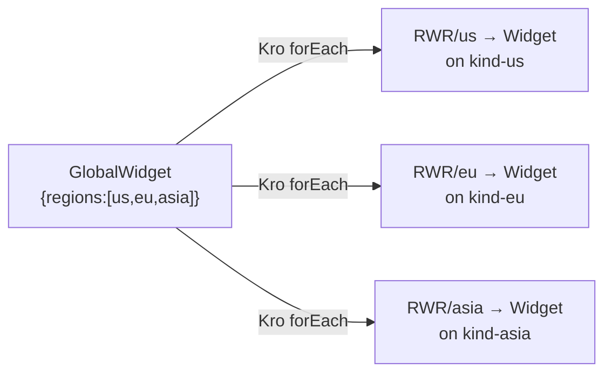

# Phase 99 — Extending to EU and ASIA Regions

The platform is designed for zero-code region extension. Adding a new spoke cluster requires only infrastructure provisioning and a single YAML file.

---

## What's Already Handled

| Aspect | Mechanism |
|--------|-----------|
| **Region list** | `spec.regions` is `[]string` on `GlobalWidget` — just add `"eu"` or `"asia"` |
| **Cluster resolution** | Binding controller uses `mgr.GetCluster(ctx, region)` — provider resolves any region name |
| **RegionalWidgetRequest** | Supports arbitrary region names (enum: `us`, `eu`, `asia` in CRD validation) |
| **Tenant isolation** | Tenant namespace routing works unchanged per-region |
| **Token rotation** | v2: Kubelet-managed projected SA tokens — no per-region config needed |
| **Phase 4–5 logic** | Kro RGD + Binding Controller — **zero changes required** |

## What's Needed Per New Region

### 1. Create the kind cluster

```bash
kind create cluster --name eu --config deploy/platform-mvp/kind/kind-eu.yaml
kind create cluster --name asia --config deploy/platform-mvp/kind/kind-asia.yaml
```

### 2. Deploy spoke components

```bash
make deploy-spoke REGION=eu
make deploy-spoke REGION=asia
```

This installs the Widget Operator + Widget CRD + OIDC Verifier per spoke.

### 3. Register on hub

For each new region, create a `ClusterProfile` and kubeconfig Secret on the hub:

```bash
# Extract internal kubeconfig from kind container
kind get kubeconfig --name eu --internal > eu-internal.kubeconfig

# Register on hub
kubectl --context kind-hub create secret generic eu-kubeconfig \
  -n default --from-file=kubeconfig=eu-internal.kubeconfig

cat <<EOF | kubectl --context kind-hub apply -f -
apiVersion: multicluster.x-k8s.io/v1alpha1
kind: ClusterProfile
metadata:
  name: eu
EOF
```

### 4. Done

In v2, the multicluster provider automatically picks up the new `ClusterProfile` and engages the new cluster. Controller auth uses projected ServiceAccount tokens (BearerTokenFile) — no token-rotator needed. Creating a `GlobalWidget{regions:[us, eu, asia]}` now produces one `RegionalWidgetRequest` per region, and the binding-controller creates Widgets on all three spokes.



### With Multi-Tenancy

```yaml
apiVersion: platform.example.com/v1alpha1
kind: GlobalWidget
metadata:
  name: acme-global
spec:
  regions: [us, eu, asia]
  message: "ACME global workload"
  tenant:
    id: acme-corp
```

This creates Widgets in `acme-corp` namespace on all three spokes — tenant isolation works identically across all regions.

---

## Required Infrastructure Per Region

| Item | Needed? | Notes |
|------|---------|-------|
| kind cluster (or real cluster) | Yes | 1 CP + workers per region |
| Widget Operator | Yes | `make deploy-spoke` |
| Widget CRD | Yes | Bundled with widget-operator |
| OIDC Verifier | Yes | All verifiers point to hub's Dex |
| Tenant namespaces + RBAC | Yes | `make deploy-spoke` creates them |
| ClusterProfile on hub | Yes | `kubectl apply -f` |
| kubeconfig Secret on hub | Yes | Internal kubeconfig from cluster |
| Dex client per region | Yes | `{region}-spoke-controller` entry in `values.yaml` (v2: controller auth uses projected SA tokens; Dex clients retained for infrastructure backward compat only) |
| GlobalWidget RGD change | **No** | Already supports arbitrary `spec.regions` |
| Binding controller change | **No** | `mgr.GetCluster(ctx, region)` generic |
| Observability change | **No** | One hub serves all regions |